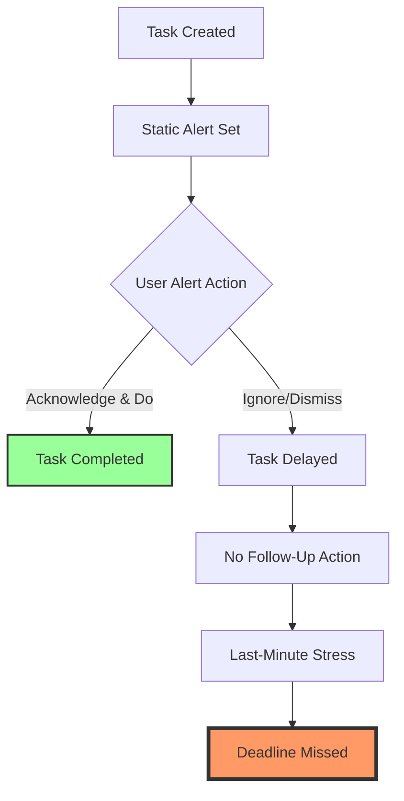
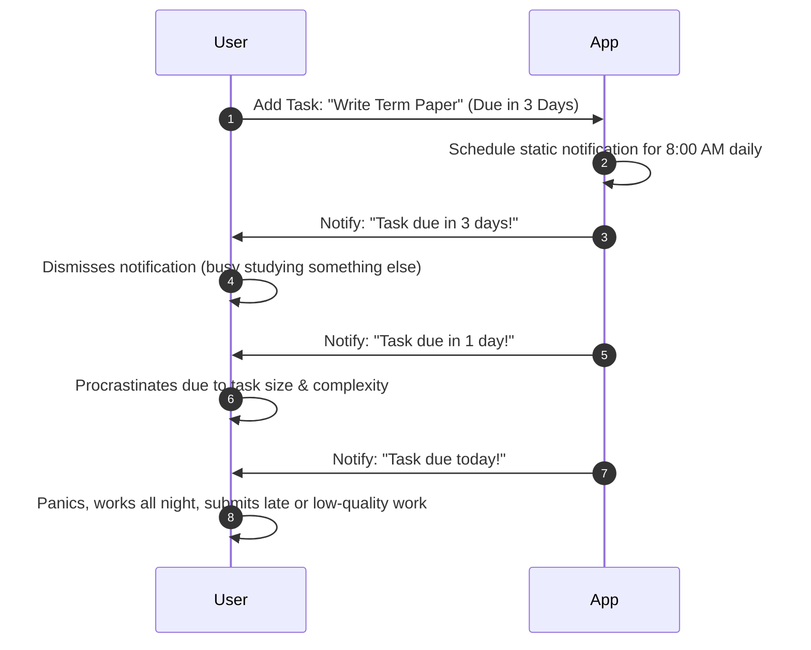
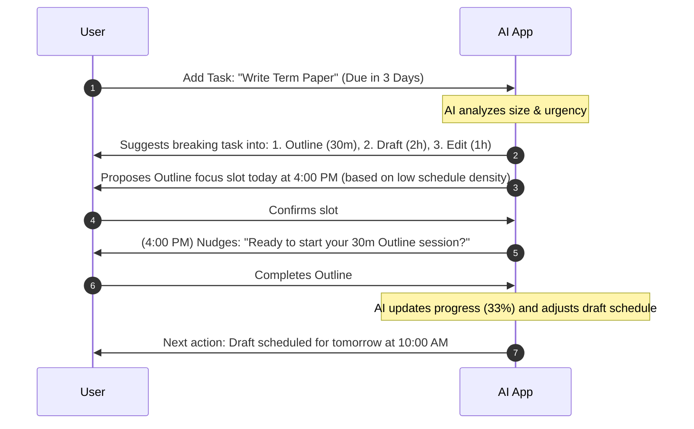

# Phase 1: Problem Understanding and Requirement Analysis

This document outlines the foundational research, user personas, problem analysis, and functional requirements for the AI-Powered Productivity Companion. No code will be written until this phase is approved, as these requirements directly dictate our architectural and AI decisions.

---

## 1. Problem Analysis & Root Cause

### The Problem
Traditional productivity tools operate as passive databases. They rely on the user to input data, set dates, and manually check lists. When deadlines approach, these systems issue generic, static alerts. If the user ignores the alert, the system fails to follow up, resulting in missed deadlines, high stress, and procrastination.

### Root Cause Analysis

The breakdown occurs at **F (No Follow-Up Action)** and **B (Static Alert Set)**. The system does not understand the user's workload, energy levels, or historical completion rates, making alerts easy to ignore.

---

## 2. Target Users & Detailed Personas

Our solution targets three distinct user segments with varying scheduling needs and constraints.

### User Personas

| Attribute | Persona 1: The Student | Persona 2: The Professional | Persona 3: The Entrepreneur |
| :--- | :--- | :--- | :--- |
| **Name** | Rahul | Priya | Arjun |
| **Age** | 20 | 28 | 35 |
| **Goal** | Submit assignments and prep for exams on time without pulling all-nighters. | Manage corporate meetings, report deadlines, and prevent developer burnout. | Coordinate client meetings, invoice follow-ups, and project milestones. |
| **Frustrations** | • Chronic procrastination • Estimating study time poorly • Feeling overwhelmed by large exams | • Back-to-back meetings • Costly context-switching • Hidden tasks in emails/chats | • Forgetting critical client check-ins • Over-committing schedules • No clear priority framework |
| **Needs** | Actionable, broken-down study plans and nudge reminders. | Protected focus blocks and automated priority sorting. | A high-level dashboard with dynamic rescheduling. |

---

## 3. User Journeys: Current vs. Proposed AI Journey

### Current Passive Journey

### Proposed Active AI-Guided Journey

---

## 4. Functional Requirements (MoSCoW Prioritization)

To build a premium, highly effective application, we prioritize the requirements as follows:

### Must Have (Phase 1-2 Core)
* **Active Task Engine**: Create, edit, delete, and group tasks.
* **AI Prioritization Engine**: An algorithm/model to dynamically sort tasks based on deadline, estimated duration, and current date.
* **AI Task Decomposition**: A feature to automatically break down larger tasks into micro-subtasks with individual estimated durations.
* **Intelligent Dashboard**: A clean, premium dashboard displaying current focus, daily schedule suggestions, and overall completion percentages.
* **Interactive AI Chat Companion**: An assistant that guides users, suggests next actions, and negotiates scheduling changes.

### Should Have (Phase 3 Enhancements)
* **Adaptive Re-scheduling**: If a user misses a slot or skips a subtask, the AI automatically recalculates and proposes an adjusted schedule.
* **Habit Tracking & Streaks**: Integrate daily habits into the schedule to maintain momentum.
* **Intelligent Push/Browser Notifications**: Notifications that adapt their tone and timing based on the user's progress.

### Could Have (Future Scope)
* **Calendar Sync**: Google/Outlook Calendar integration to auto-detect busy blocks.
* **Gamification System**: Rewards, levels, or productivity metrics to incentivize task completion.

---

## 5. Proposed Technology Stack (Web Application)

For a modern, highly interactive, and responsive web app, we will use:
- **Frontend**: React (Vite-powered for rapid development) with TypeScript.
- **Styling**: Vanilla CSS with custom properties (CSS variables) to support a premium, responsive glassmorphism dark theme with smooth micro-animations.
- **State Management**: React Context or Zustand for local state persistence in LocalStorage.
- **AI Integration**: Integration with the Gemini API to execute task prioritization, task decomposition, and conversational companion interactions.
